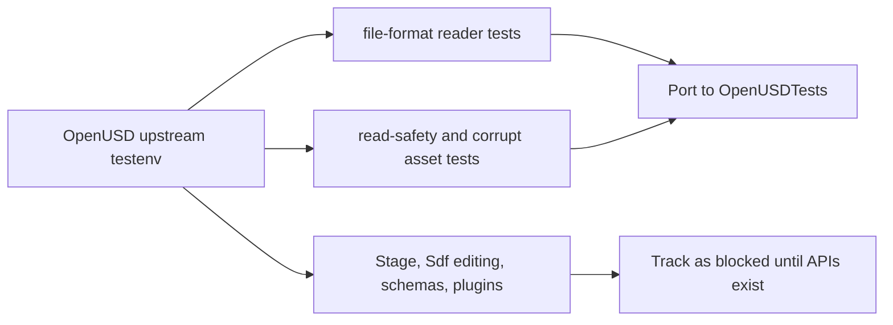

# OpenUSD Upstream Test Parity

This file tracks the OpenUSD upstream tests that are relevant to the current
pure Swift reader scope.

The goal is full parity over time, but the current package is a reader-focused
subset. Tests that require APIs not yet present in `swift-OpenUSD` are tracked
as blocked instead of silently omitted.

## Source

| Field | Value |
|---|---|
| Repository | `https://github.com/PixarAnimationStudios/OpenUSD` |
| Branch | `dev` |
| Commit | `32ef0b2d9a301167dd1016e42cf1c0f5194ef0fa` |
| Last verified | `2026-06-05` |

## Status Values

| Status | Meaning |
|---|---|
| `ported` | The upstream fixture or behavior has a Swift test in `OpenUSDTests`. |
| `partial` | A subset is covered, but upstream assertions are not fully represented. |
| `blocked` | The upstream test requires APIs or behavior outside the current reader surface. |
| `pending` | The fixture or test intent is relevant and not yet ported. |

## Reader Parity Flow

## Current Upstream Fixtures

| Upstream testenv | Fixture | Status | Swift coverage |
|---|---|---|---|
| `pxr/usd/usd/testenv/testUsdFileFormats` | `ascii.usd` | `partial` | `openUSDFileFormatAsciiFixtureReadsLayerSpecs`; prim specifier, type name, and path visibility are covered; arbitrary field/spec preservation requires broader Sdf field modeling |
| `pxr/usd/usd/testenv/testUsdFileFormats` | `crate.usd` | `ported` | `openUSDFileFormatCrateFixtureReadsStructuralTables`, `openUSDFileFormatCrateFixtureKeepsLazyReadsStableAfterSourceDataMutation`, `openUSDFileFormatCrateFixtureReadsLayerSpecs` |
| `pxr/usd/sdf/testenv/testSdfUsdcInvalidPrimChildren.testenv` | `root.usdc`, `duplicate_prim_children.usdc` | `ported` | `openUSDSDFUSDCInvalidPrimChildrenFixtureThrowsTypedError`, `openUSDSDFUSDCDuplicatePrimChildrenFixtureThrowsTypedError`; `readLayer` and scene materialization both reject invalid `primChildren` |
| `pxr/usd/sdf/testenv/testSdfZipFile.testenv` | `test_reader.usdz`, `src/*` | `partial` | `openUSDSDFZipFileReaderFixtureReadsEntryInfoAndData`; writer assertions are blocked until a Swift USDZ writer API exists |
| `pxr/usd/sdf/testenv/testSdfUsdzResolver` | `test.usdz`, `src/*` | `partial` | `openUSDSDFUSDZResolverFixtureReadsEntriesAndNestedData`; `ArAsset` buffer/read/file-handle APIs are represented through archive entry data, sizes, offsets, and nested layer paths |
| `pxr/usd/sdf/testenv/testSdfParsing.testenv` | `01_empty.usda`, `203_newlines.usda`, `204_really_empty.usda` | `partial` | `openUSDSDFParsingEmptyFixturesReadLayers`; upstream export, metadata-only open, and baseline output comparisons are blocked until writer and diagnostic APIs exist |
| `pxr/usd/sdf/testenv/testSdfParsing.testenv` | `03_bad_file.usda` | `ported` | `openUSDSDFParsingBadFileFixtureThrowsTypedError`; unexpected top-level syntax is rejected with `USDImportError.invalidData` |
| `pxr/usd/sdf/testenv/testSdfParsing.testenv` | `05_bad_file.usda`, `08_bad_file.usda`, `09_bad_type.usda` | `ported` | `openUSDSDFParsingUnterminatedFixtureThrowsTypedError`; unterminated list/body and string scanning cases are rejected with typed errors |
| `pxr/usd/sdf/testenv/testSdfParsing.testenv` | `10_bad_value.usda`, `12_bad_value.usda`, `13_bad_value.usda`, `14_bad_value.usda` | `ported` | `openUSDSDFParsingBadScalarValueFixturesThrowTypedErrors`; invalid scalar bool, string, and int values are rejected with `USDImportError.invalidData` |
| `pxr/usd/sdf/testenv/testSdfParsing.testenv` | `15_bad_list.usda`, `16_bad_list.usda`, `69_bad_list.usda`, `70_bad_list.usda`, `179_bad_shaped_attr_dimensions1.usda` | `ported` | `openUSDSDFParsingBadNestedArrayFixturesThrowTypedErrors`; array attributes reject nested shaped list values while preserving quote-aware scanning |
| `pxr/usd/sdf/testenv/testSdfParsing.testenv` | `22_bad_newline2.usda` | `ported` | `openUSDSDFParsingBadPrimDeclarationNewlineFixtureThrowsTypedError`; prim specifier, type, and name must stay on one line |
| `pxr/usd/sdf/testenv/testSdfParsing.testenv` | `32_relationship_syntax.usda` | `partial` | `openUSDSDFParsingRelationshipSyntaxFixtureReadsLayer`; relationship declarations and list-edit syntax are accepted for reader-visible prim structure, but relationship spec preservation requires broader Sdf field modeling |
| `pxr/usd/sdf/testenv/testSdfParsing.testenv` | `33_bad_relationship_duplicate_target.usda` | `ported` | `openUSDSDFParsingDuplicateRelationshipTargetFixtureThrowsTypedError`; relationship target lists reject duplicate target paths |
| `pxr/usd/sdf/testenv/testSdfParsing.testenv` | `90_bad_dupePrim.usda` | `ported` | `openUSDSDFParsingDuplicatePrimFixtureThrowsTypedError`; duplicate prim paths are rejected for layer and scene reads |
| `pxr/usd/sdf/testenv/testSdfParsing.testenv` | `91_bad_valueType.usda`, `96_bad_valueType.usda`, `97_bad_valueType.usda`, `98_bad_valueType.usda` | `ported` | `openUSDSDFParsingBadValueTypeFixturesThrowTypedErrors`; shaped and scalar attribute declarations must receive matching value shapes |
| `pxr/usd/sdf/testenv/testSdfParsing.testenv` | `02_simple.usda`, `07_end.usda`, `20_optionalsemicolons.usda`, `41_noEndingNewline.usda` | `partial` | `openUSDSDFParsingSimpleFixtureReadsDefAndOverPrimSpecsAndTransforms`, `openUSDSDFParsingEndTokenFixtureIgnoresTrailingGarbage`, `openUSDSDFParsingOptionalSemicolonsFixtureReadsSublayersAndPrimTransforms`, `openUSDSDFParsingNoEndingNewlineFixtureReadsLayer`; prim structural specs are covered where reader-visible; arbitrary field/spec preservation requires broader Sdf field modeling |
| `pxr/usd/sdf/testenv/testSdfParsing.testenv` | `46_weirdStringContent.usda` | `partial` | `openUSDSDFParsingWeirdStringContentFixtureSkipsQuotedDelimiters`; escaped, single-quoted, and multiline strings are covered for delimiter scanning; string value preservation and writer parity require Sdf spec preservation |
| `pxr/usd/sdf/testenv/testSdfParsing.testenv` | `71_empty_shaped_attrs.usda`, `111_string_arrays.usda` | `partial` | `openUSDSDFParsingArrayValueSyntaxFixturesReadLayers`; empty shaped arrays and string/token arrays are accepted, but array value preservation requires broader Sdf field modeling |
| `pxr/usd/sdf/testenv/testSdfParsing.testenv` | `104_uniformAttributes.usda`, `113_displayName_metadata.usda`, `115_symmetricPeer_metadata.usda`, `127_varyingRelationship.usda`, `187_displayName_metadata.usda` | `partial` | `openUSDSDFParsingMetadataSyntaxFixturesReadLayers`; valid uniform, varying relationship, display name, prefix/suffix, and symmetric peer metadata syntax is accepted, but metadata field preservation requires broader Sdf spec modeling |
| `pxr/usd/sdf/testenv/testSdfParsing.testenv` | `80_bad_hidden.usda`, `94_bad_hiddenAttr.usda`, `95_bad_hiddenRel.usda` | `ported` | `openUSDSDFParsingBadHiddenMetadataFixturesThrowTypedErrors`; invalid `hidden` metadata bool values are rejected on prims, attributes, and relationships |
| `pxr/usd/sdf/testenv/testSdfParsing.testenv` | `93_hidden.usda` | `partial` | `openUSDSDFParsingHiddenMetadataFixtureReadsLayer`; valid `hidden` metadata syntax is accepted, but metadata field preservation requires broader Sdf spec modeling |
| `pxr/usd/sdf/testenv/testSdfParsing.testenv` | `116_permission_metadata.usda` | `partial` | `openUSDSDFParsingPermissionMetadataFixtureReadsLayer`; valid `permission` metadata syntax is accepted, but metadata field preservation requires broader Sdf spec modeling |
| `pxr/usd/sdf/testenv/testSdfParsing.testenv` | `117_bad_permission_metadata.usda`, `118_bad_permission_metadata_2.usda`, `119_bad_permission_metadata_3.usda` | `ported` | `openUSDSDFParsingBadPermissionMetadataFixturesThrowTypedErrors`; invalid `permission` metadata values are rejected on attributes, relationships, and prims |
| `pxr/usd/sdf/testenv/testSdfParsing.testenv` | `149_kind_metadata.usda` | `partial` | `openUSDSDFParsingKindMetadataFixtureReadsLayer`; valid `kind` metadata syntax is accepted, but metadata field preservation requires broader Sdf spec modeling |
| `pxr/usd/sdf/testenv/testSdfParsing.testenv` | `150_bad_kind_metadata_1.usda` | `ported` | `openUSDSDFParsingBadKindMetadataFixtureThrowsTypedError`; `kind` metadata must be authored as a string |
| `pxr/usd/sdf/testenv/testSdfParsing.testenv` | `154_relationship_noLoadHint.usda` | `partial` | `openUSDSDFParsingRelationshipNoLoadHintFixtureReadsLayer`; valid relationship `noLoadHint` metadata syntax is accepted, but metadata field preservation requires broader Sdf spec modeling |
| `pxr/usd/sdf/testenv/testSdfParsing.testenv` | `155_bad_relationship_noLoadHint.usda` | `ported` | `openUSDSDFParsingBadRelationshipNoLoadHintFixtureThrowsTypedError`; relationship `noLoadHint` metadata must be authored as a bool |
| `pxr/usd/sdf/testenv/testSdfParsing.testenv` | `217_utf8_identifiers.usda` | `partial` | `openUSDSDFParsingUTF8IdentifiersFixtureReadsDefaultPrimAndTransforms`; UTF-8 default prim names, quoted prim paths, and transform inheritance are covered; arbitrary UTF-8 field names, custom data, property values, and writer parity require Sdf spec preservation |
| `pxr/usd/sdf/testenv/testSdfParsing.testenv` | `218_utf8_bad_identifier.usda` | `ported` | `openUSDSDFParsingUTF8BadIdentifierFixtureThrowsTypedError`; invalid UTF-8 prim identifiers are rejected with `USDImportError.invalidData` while valid `217_utf8_identifiers.usda` remains accepted |
| `pxr/usd/sdf/testenv/testSdfParsing.testenv` | `219_utf8_bad_type_name.usda` | `ported` | `openUSDSDFParsingUTF8BadTypeNameFixtureThrowsTypedError`; invalid UTF-8 property type names are rejected while valid UTF-8 property names remain accepted |
| `pxr/usd/sdf/testenv/testSdfParsing.testenv` | `132_references.usda`, `152_payloads.usda` | `partial` | `openUSDSDFParsingReferencesFixtureReadsSupportedExternalArcs`, `openUSDSDFParsingPayloadsFixtureReadsSupportedExternalArcs`; external asset arcs, offsets, and escaped `@@` asset identifiers are covered; prim-only arcs, list-edit semantics, arc custom data, and writer parity require composition model expansion |
| `pxr/usd/sdf/testenv/testSdfParsing.testenv` | `133_bad_reference.usda` | `ported` | `openUSDSDFParsingBadReferenceFixtureThrowsTypedError`; empty external asset references are rejected |
| `pxr/usd/sdf/testenv/testSdfParsing.testenv` | `153_bad_payloads.usda` | `ported` | `openUSDSDFParsingBadPayloadsFixtureThrowsTypedError`; payload `add` and `reorder` list-edit assignments must use bracketed list values |
| `pxr/usd/usd/testenv/testUsdReadOutOfBounds` | `corrupt.usd` | `ported` | `openUSDReadOutOfBoundsFixtureThrowsTypedError` |
| `pxr/usd/usd/testenv/testUsdUsdcBugGHSA02.testenv` | `root.usdc` | `ported` | `openUSDUSDCSecurityFixtureThrowsTypedError` |
| `pxr/usd/usd/testenv/testUsdUsdzBugGHSA01.testenv` | `root.usdz` | `ported` | `openUSDUSDZSecurityFixtureThrowsTypedError` |
| `pxr/usd/usd/testenv/testUsdUsdzFileFormat` | `single_usd.usdz`, `single_usda.usdz`, `single_usdc.usdz` | `ported` | Archive default layer tests and contained layer graph tests |
| `pxr/usd/usd/testenv/testUsdUsdzFileFormat` | `anchored_refs*.usdz` | `ported` | `usdzReaderReadsAnchoredReferenceGraphsFromOpenUSDFixtures` and layer path tests |
| `pxr/usd/usd/testenv/testUsdUsdzFileFormat` | `search_refs*.usdz` | `ported` | `usdzReaderReadsSearchReferenceGraphsFromOpenUSDFixtures` and layer path tests |
| `pxr/usd/usd/testenv/testUsdUsdzFileFormat` | `nested_*refs*.usdz` | `ported` | `usdzReaderReadsNestedSubdirectoryReferenceGraphsFromOpenUSDFixtures` and specific layer path tests, including explicit nested root layer paths |
| `pxr/usd/usd/testenv/testUsdUsdzFileFormat` | `first_file_not_usd.usdz` | `ported` | Typed rejection and archive entry tests |

## Next Upstream Categories

| Priority | Upstream area | Status | Next action |
|---:|---|---|---|
| 1 | `testUsdFileFormats` Python assertions | `partial` | Port remaining load/identifier assertions that map to reader APIs. |
| 2 | `testUsdUsdzFileFormat` Python assertions | `partial` | Add tests for every currently copied package path and layer path edge. |
| 3 | `testUsdReadOutOfBounds` | `ported` | Keep checking that corrupt assets produce typed bounds-checking errors. |
| 4 | `testUsdUsdcBugGHSA02` | `ported` | Keep checking that corrupt USDC security fixtures produce typed read failures. |
| 5 | `testUsdUsdzBugGHSA01` | `ported` | Keep checking that corrupt USDZ security fixtures produce typed archive or crate failures. |
| 6 | `testSdfZipFile` reader assertions | `partial` | Keep checking file names, entry metadata, alignment, CRC, and source payload bytes. |
| 7 | `testSdfZipFile` writer assertions | `blocked` | Define a Swift USDZ writer API before porting writer, discard, alignment, and empty archive writer tests. |
| 8 | `testSdfUsdcInvalidPrimChildren` | `ported` | Keep checking that invalid child-name and duplicate-child fixtures produce typed `primChildren` errors. |
| 9 | `testSdfUsdzResolver` | `partial` | Keep checking package entry open, source bytes, sizes, absolute offsets, and nested package paths; full `ArAsset` API parity is blocked until an asset object API exists. |
| 10 | `pxr/usd/sdf/testenv` file and value parsing subset | `partial` | Continue porting USDA parsing fixtures that map to `USDAReader` and `USDLayer`; define writer, diagnostic, metadata-only, Sdf spec, and list-edit APIs for full `testSdfParsing` parity. |
| 11 | Stage composition, Sdf editing, schema, plugin, imaging tests | `blocked` | Define public APIs first, then port relevant upstream suites. |

## Completion Rules

An upstream test is not considered complete until the Swift test checks the
same reader-visible behavior against the same fixture or an explicitly recorded
equivalent fixture. Unsupported APIs must remain listed in this file until the
reader or model surface can express the behavior.
